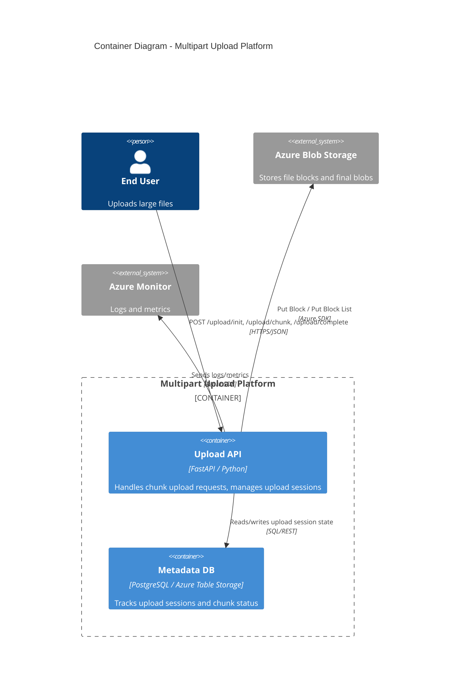

# C4 Diagram — Container Level

```mermaid
C4Container
    title Container Diagram - Multipart Upload Platform

    Person(user, "End User", "Uploads large files")

    Container_Boundary(platform, "Multipart Upload Platform") {
        Container(api, "Upload API", "FastAPI / Python", "Handles chunk upload requests, manages upload sessions")
        Container(db, "Metadata DB", "PostgreSQL / Azure Table Storage", "Tracks upload sessions and chunk status")
    }

    System_Ext(azureBlob, "Azure Blob Storage", "Stores file blocks and final blobs")
    System_Ext(monitoring, "Azure Monitor", "Logs and metrics")

    Rel(user, api, "POST /upload/init, /upload/chunk, /upload/complete", "HTTPS/JSON")
    Rel(api, db, "Reads/writes upload session state", "SQL/REST")
    Rel(api, azureBlob, "Put Block / Put Block List", "Azure SDK")
    Rel(api, monitoring, "Sends logs/metrics", "Azure SDK")
```