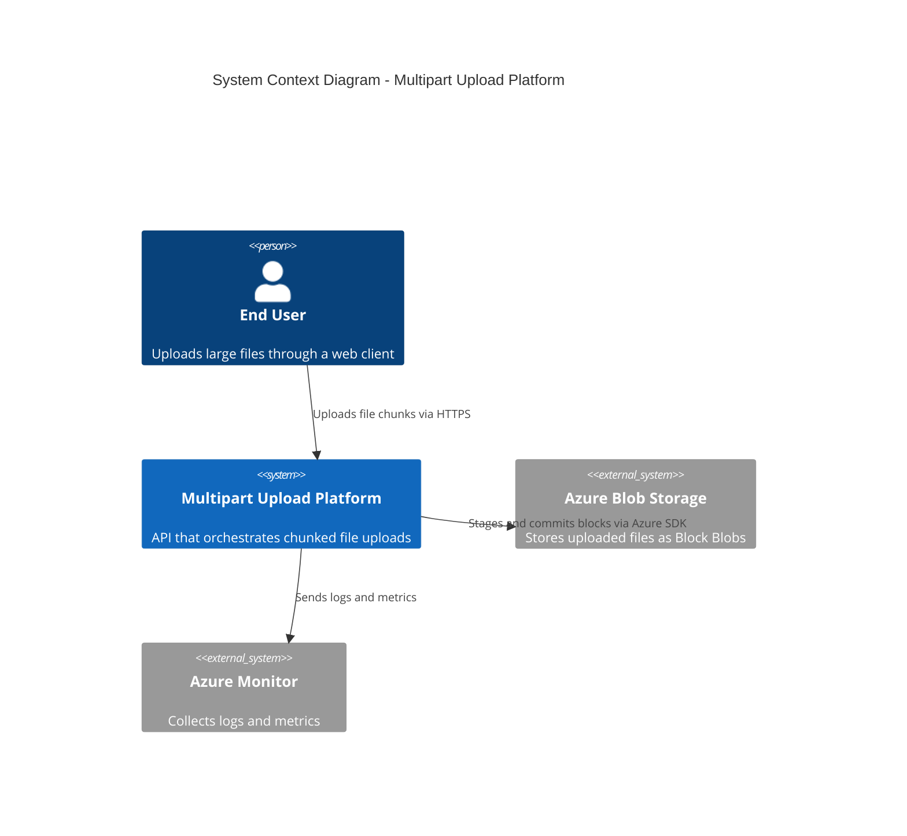

# C4 Diagram — Context Level

```mermaid
C4Context
    title System Context Diagram - Multipart Upload Platform

    Person(user, "End User", "Uploads large files through a web client")
    System(platform, "Multipart Upload Platform", "API that orchestrates chunked file uploads")
    System_Ext(azureBlob, "Azure Blob Storage", "Stores uploaded files as Block Blobs")
    System_Ext(monitoring, "Azure Monitor", "Collects logs and metrics")

    Rel(user, platform, "Uploads file chunks via HTTPS")
    Rel(platform, azureBlob, "Stages and commits blocks via Azure SDK")
    Rel(platform, monitoring, "Sends logs and metrics")
```